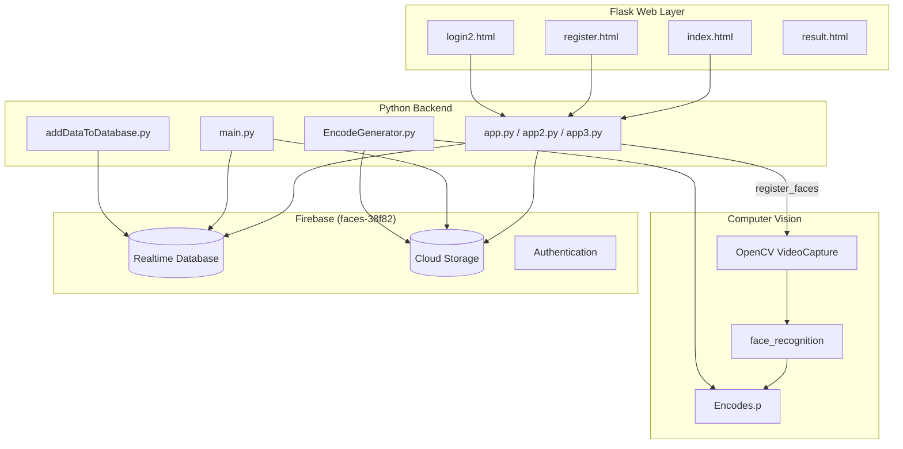
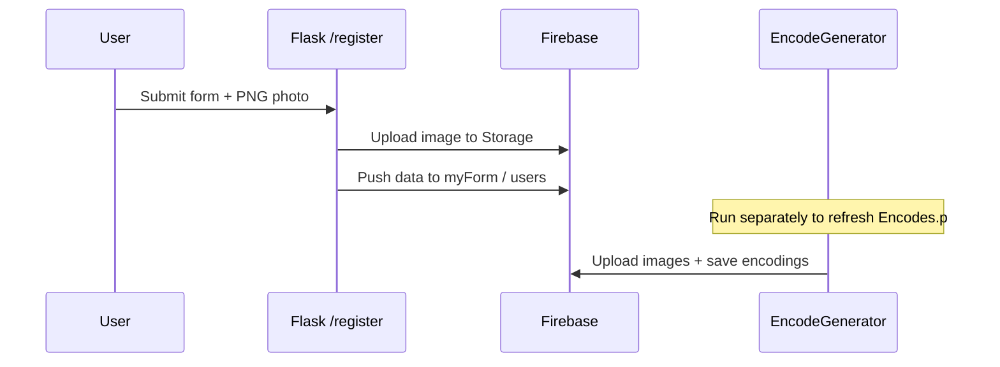
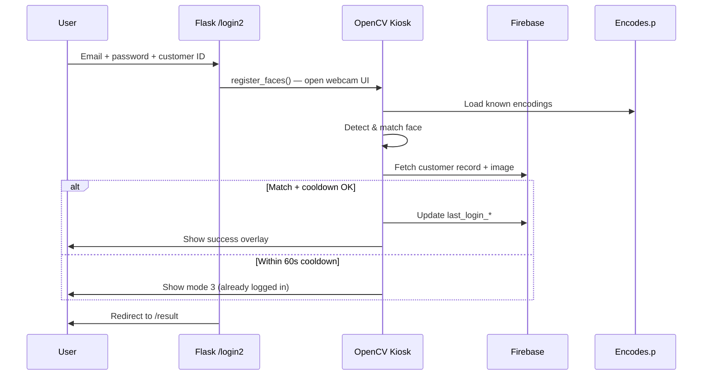

# Finxthon — C.O.D.E-Breakers | Face Recognition Banking System

**Repository:** [finxthon-C.O.D.E-Breakers-](https://github.com/Tushar00012/finxthon-C.O.D.E-Breakers-.git)  
**Workspace:** `WEBpageslatest - Copy`  
**Product theme:** ASBC Bank — web portal with facial authentication for customer login

---

## Table of Contents

1. [Overview](#overview)
2. [Features](#features)
3. [Architecture](#architecture)
4. [Technology Stack](#technology-stack)
5. [Project Structure](#project-structure)
6. [Application Modules](#application-modules)
7. [Web Routes & Pages](#web-routes--pages)
8. [Face Recognition Pipeline](#face-recognition-pipeline)
9. [Firebase Integration](#firebase-integration)
10. [Database Schema](#database-schema)
11. [User Flows](#user-flows)
12. [Static Assets & UI](#static-assets--ui)
13. [Setup & Installation](#setup--installation)
14. [Running the Application](#running-the-application)
15. [Required External Assets](#required-external-assets)
16. [Security Notes](#security-notes)
17. [Known Limitations & Issues](#known-limitations--issues)
18. [File Reference](#file-reference)

---

## Overview

This project is a **banking-style web application** that combines:

- A **Flask** front-end (HTML templates + CSS) mimicking an ASBC Bank portal
- **Firebase** (Realtime Database, Storage, Authentication) for user and customer data
- **OpenCV** + **face_recognition** for live webcam face detection and identity verification

Users register with profile details and a face photo, then log in via the web UI. After credentials are submitted, the system opens a **live facial authentication** window that matches the user’s face against pre-encoded face data stored in `Encodes.p`, loads customer info from Firebase, and grants access on a successful match.

The repo name **C.O.D.E-Breakers** and event context **Finxthon** indicate this was built as a hackathon / competition project.

---

## Features

| Area | Capability |
|------|------------|
| **Banking UI** | Home page with nav (Accounts, Deposits, Loans, etc.), promotional images, footer |
| **Registration** | Name, Customer ID, password, DOB, gender, email, address, PNG photo upload (216×216) |
| **Login** | Customer ID, email, password → triggers face auth |
| **Face encoding** | Batch encode faces from `images/` folder → `Encodes.p` pickle file |
| **Live auth** | Webcam overlay on background UI with mode states (scanning, active, success, cooldown) |
| **Firebase sync** | Store user/form data, profile images, last login timestamps |
| **Cooldown** | Re-login within 60 seconds shows “already logged in” mode instead of updating again |
| **Result portal** | Post-auth success page with banking sidebar links |

---

## Architecture



**Two operational modes:**

1. **Web mode** — Run `app.py`, `app2.py`, or `app3.py` for registration/login via browser.
2. **Standalone kiosk mode** — Run `main.py` for continuous facial authentication (no Flask).

---

## Technology Stack

| Layer | Libraries / Tools |
|-------|-------------------|
| **Web framework** | Flask |
| **Computer vision** | OpenCV (`cv2`), `face_recognition`, `cvzone`, NumPy |
| **Firebase (client)** | Pyrebase4, Firebase JS SDK v10.6.0 (in templates) |
| **Firebase (admin)** | `firebase_admin` (credentials, db, storage) |
| **Serialization** | Pickle (`Encodes.p`) |
| **Frontend** | HTML5, CSS3, vanilla JavaScript (ES modules) |
| **File handling** | Werkzeug `secure_filename` |

---

## Project Structure

```
WEBpageslatest - Copy/
├── app.py                  # Flask app — basic registration + face capture
├── app2.py                 # Flask app — session-based login (users node)
├── app3.py                 # Flask app — integrated face auth kiosk in login flow
├── main.py                 # Standalone facial authentication (OpenCV window)
├── EncodeGenerator.py      # Build Encodes.p from images/ + upload to Storage
├── addDataToDatabase.py    # Seed myForm with sample customer records
├── serviceAccountKey.json  # Firebase Admin SDK credentials (DO NOT commit publicly)
│
├── templates/
│   ├── index.html          # ASBC Bank home page
│   ├── register.html       # Customer registration form
│   ├── login2.html         # Customer login form
│   ├── result.html         # Post-authentication portal
│   └── final.html          # Simple “details uploaded” placeholder
│
├── static/
│   └── css/
│       ├── style.css       # Home page styles
│       ├── style2.css      # Result page styles
│       ├── styles.css      # Login page styles
│       └── stylereg.css    # Registration page styles
│
├── image_files/            # Downloaded third-party CSS/JS assets (not used by Flask routes)
│
└── (expected at runtime, not in repo snapshot)
    ├── images/             # Face PNGs named by customer ID (e.g. 9560071054.png)
    ├── Resources/
    │   ├── background.png  # Kiosk UI background
    │   └── Modes/          # Mode indicator images (0.png, 1.png, 2.png, 3.png)
    ├── Encodes.p           # Pickled [encodings_list, customer_ids_list]
    └── uploads/            # Temporary uploaded images
```

---

## Application Modules

### `app.py` — Primary Flask entry (simpler flow)

- **Pyrebase** for Firebase client operations.
- **Routes:** `/`, `/index`, `/login2`, `/register`, `/final`, `/result`.
- **Login (`/login2`):** On POST, captures `person_name`, runs `register_faces()`, saves to Firebase, redirects to `/result`.
- **Register (`/register`):** Uploads PNG to Storage (`images/{filename}`), pushes form data to `myForm` via `save_to_firebase()`.
- **Face capture:** `register_faces()` opens webcam, draws rectangles, saves frame on `q` keypress.

### `app2.py` — Session + Realtime Database `users`

- Session-based auth comparing email/password against `users` node.
- Registration uploads image via `upload_file_to_storage()`, stores user under `users` with `push()`.
- Protected `/result` route (requires `session['user_id']`).
- Large blocks of commented legacy `firebase_admin` code.

### `app3.py` — Full integrated facial kiosk (recommended for demo)

- Combines Flask web UI with **embedded `main.py` logic** inside `register_faces()`.
- Uses both **Pyrebase** (web forms) and **firebase_admin** (blob download, encode matching).
- Registration creates Firebase Auth user + uploads image + saves to `myForm`.
- Login triggers live facial authentication UI (“Facial Authentication” OpenCV window).
- **Modes during auth:**
  - `0` — Scanning / idle
  - `1` — Face matched, loading customer data
  - `2` — Active (counter 10–30)
  - `3` — Cooldown (logged in within last 60 seconds)

### `main.py` — Standalone kiosk

- No Flask; runs continuous webcam loop.
- Reads `Encodes.p`, matches faces, fetches `myForms/{id}` from Realtime Database.
- Overlays webcam on `Resources/background.png`, shows customer name/ID/last login.
- Updates `last_login_dnt`, `last_login_time`, `last_login_date` if >60s since last login.
- Records video to `.mp4` (filename appears incomplete in code: `".mp4"`).

### `EncodeGenerator.py` — Encoding pipeline

1. Reads all images from `images/` folder.
2. Extracts customer IDs from filenames (without extension).
3. Uploads each image to Firebase Storage.
4. Generates face encodings via `face_recognition.face_encodings()`.
5. Saves `[knownEncodeList, customerIDs]` to `Encodes.p`.

**Note:** `findencodings()` is defined inside the `for` loop (works but is inefficient); run once after placing all face images in `images/`.

### `addDataToDatabase.py` — Database seeder

- Seeds `myForm` with three sample customers:
  - Abhishek Rathi (`8700107929`)
  - Tushar Ranjan (`9560071054`)
  - Rishi Varshney (`8708724179`)
- Each record includes `customer_name`, `customerid`, `last_login_date`, `last_login_time`, `last_login_dnt`.

---

## Web Routes & Pages

| Route | Method | Template | Handler | Purpose |
|-------|--------|----------|---------|---------|
| `/` | GET | `index.html` | `home()` | Bank home page |
| `/index` | GET | `index.html` | `page1()` | Same as home |
| `/login2` | GET, POST | `login2.html` | `page2()` | Login + face auth trigger |
| `/register` | GET, POST | `register.html` | `register()` / `page3()` | New customer signup |
| `/result` | GET | `result.html` | `result()` | Success portal after auth |
| `/final` | GET | `final.html` | `page5()` | Upload confirmation stub |

### Template details

| File | Title | Key elements |
|------|-------|--------------|
| `index.html` | ASBC Bank | Nav bar, hero image, loan/savings promos, footer |
| `register.html` | Register | Full registration form, PNG validation (216×216), Firebase JS signup script |
| `login2.html` | Login-Page | Customer ID, email, password, Firebase JS sign-in script |
| `result.html` | Main Portal | “Authentication Successful”, banking sidebar |
| `final.html` | Document | Minimal “details uploadesd” message |

Templates reference static images under `static/images/` (e.g. `logo.ico`, `image.png`, `personalloan.jpeg`) — ensure these exist before running.

---

## Face Recognition Pipeline

```
1. Prepare images/
   └── {customer_id}.png  (one face per file, filename = ID)

2. Run EncodeGenerator.py
   └── Produces Encodes.p + uploads to Firebase Storage

3. Runtime (main.py or app3 register_faces)
   ├── Capture webcam frame (640×480)
   ├── Resize to 25% for detection speed
   ├── face_locations() + face_encodings()
   ├── compare_faces() + face_distance() → best match index
   ├── If match: load myForm/{id} or myForms/{id} from RTDB
   ├── Download images/{id}.png from Storage
   ├── Display customer info on UI overlay
   └── Update login timestamps (if cooldown expired)
```

**Matching logic:** Uses `np.argmin(face_distance)` for best match; accepts match if `compare_faces` is True at that index.

---

## Firebase Integration

| Service | Project | Usage |
|---------|---------|-------|
| **Project ID** | `faces-38f82` | Main Firebase project |
| **Realtime Database** | `https://faces-38f82-default-rtdb.firebaseio.com/` | Customer & user records |
| **Storage Bucket** | `faces-38f82.appspot.com` | Profile images at `images/{id}.png` |
| **Authentication** | Firebase Auth | Email/password (app3, register.html, login2.html) |

### Configuration files

| File | Role |
|------|------|
| `serviceAccountKey.json` | Admin SDK — used by `main.py`, `EncodeGenerator.py`, `addDataToDatabase.py`, `app3.py` |
| Inline `firebaseConfig` in Python/JS | Client SDK — used by Pyrebase and browser scripts |

### Database nodes (variants across files)

| Node | Used by | Structure |
|------|---------|-----------|
| `myForm` | `app.py`, `app3.py`, `addDataToDatabase.py` | Push (auto ID) or keyed by customer ID |
| `myForms` | `main.py` | Keyed by customer ID (note plural — inconsistency) |
| `users` | `app2.py`, `register.html` JS | Keyed by Firebase UID |

---

## Database Schema

### `myForm` / `myForms` customer record (kiosk auth)

```json
{
  "customer_name": "string",
  "customerid": "string",
  "last_login_date": "YYYY-MM-DD",
  "last_login_time": "HH:MM:SS",
  "last_login_dnt": "YYYY-MM-DD HH:MM:SS"
}
```

### Registration form data (`app.py` / `app3.py`)

```json
{
  "name": "string",
  "person_name": "string",
  "pass": "string",
  "password": "string",
  "date": "string",
  "gender": "string",
  "email": "string",
  "address": "string",
  "image_url": "string"
}
```

### `users` node (`app2.py`)

```json
{
  "name": "string",
  "email": "string",
  "gender": "string",
  "date": "string",
  "address": "string",
  "password": "string",
  "check1": "string",
  "person_name": "string",
  "image": "string"
}
```

---

## User Flows

### Registration



### Login with facial authentication (`app3.py`)



---

## Static Assets & UI

### CSS files

| File | Used by |
|------|---------|
| `static/css/style.css` | `index.html` |
| `static/css/style2.css` | `result.html` |
| `static/css/styles.css` | `login2.html`, `register.html` |
| `static/css/stylereg.css` | `register.html` |

### Design tokens (approximate)

- Primary heading color: `#033e97`
- Nav background: `#fabc98`
- Accent / hover underline: `#009688`
- Header background: `rgb(252, 220, 194)`

### `image_files/`

Contains downloaded vendor bundles (Facebook/Meta-style app chunks). **Not wired into Flask templates** — likely saved from browser devtools during development. Safe to ignore for normal app execution.

---

## Setup & Installation

### Prerequisites

- Python 3.8+ (3.9 recommended for `face_recognition` compatibility)
- Webcam
- Firebase project with Realtime Database, Storage, and Authentication enabled
- `serviceAccountKey.json` from Firebase Console → Project Settings → Service Accounts

### Python dependencies

Create `requirements.txt` (not present in repo; install manually):

```txt
flask
opencv-python
face-recognition
cvzone
numpy
pyrebase4
firebase-admin
werkzeug
```

Install:

```bash
pip install flask opencv-python face-recognition cvzone numpy pyrebase4 firebase-admin werkzeug
```

**Note:** `face_recognition` requires `cmake` and `dlib` on some systems. On macOS: `brew install cmake` then pip install.

### Firebase setup checklist

1. Create project (or use existing `faces-38f82`).
2. Enable **Realtime Database** (test mode or secured rules).
3. Enable **Storage** and set rules for `images/` path.
4. Enable **Email/Password** authentication.
5. Download `serviceAccountKey.json` into project root.
6. Add web app config to match `firebaseConfig` in code (or use env variables).

### Prepare face data

```bash
mkdir -p images Resources/Modes uploads
# Add face PNGs: images/{customer_id}.png
# Add Resources/background.png and mode images 0.png–3.png
python EncodeGenerator.py    # Creates Encodes.p
python addDataToDatabase.py  # Optional: seed sample customers
```

---

## Running the Application

| Command | Description |
|---------|-------------|
| `python app.py` | Basic Flask server (port 5000, debug) |
| `python app2.py` | Flask with session-based users DB |
| `python app3.py` | **Recommended** — full web + kiosk face auth |
| `python main.py` | Standalone facial auth kiosk (no browser) |
| `python EncodeGenerator.py` | Regenerate `Encodes.p` from `images/` |
| `python addDataToDatabase.py` | Seed sample `myForm` data |

Open browser: `http://127.0.0.1:5000/`

---

## Required External Assets

These paths are referenced in code but may be **missing from the repository clone**. Add them before running face auth:

| Path | Purpose |
|------|---------|
| `images/*.png` | Source faces for encoding (filename = customer ID) |
| `Encodes.p` | Generated by `EncodeGenerator.py` |
| `Resources/background.png` | Kiosk UI background (1275×720 approx.) |
| `Resources/Modes/0.png` … `3.png` | UI state indicators |
| `static/images/*` | Bank branding images for HTML templates |
| `uploads/` | Temp folder for registration uploads |

---

## Security Notes

> **Important:** This project contains **hardcoded Firebase API keys** and a **service account JSON** in the repository. For production or public repos:

1. **Rotate** all exposed Firebase credentials immediately.
2. Move secrets to environment variables (`.env` + `python-dotenv`).
3. Add `serviceAccountKey.json` to `.gitignore`.
4. Use Firebase Security Rules to restrict database/storage access.
5. Do not store plaintext passwords in Realtime Database (`app2.py`, form fields).
6. Replace client-side password fields with proper `type="password"` and server-side validation.

---

## Known Limitations & Issues

| Issue | Details |
|-------|---------|
| **Multiple app entry points** | `app.py`, `app2.py`, `app3.py` overlap; use one consistently |
| **DB path inconsistency** | `myForm` vs `myForms` between `main.py` and other modules |
| **Field name mismatch** | Kiosk expects `customer_name` / `customerid`; registration saves `name` / `person_name` |
| **login2 password input** | Missing `name="password"` attribute — form POST may not send password |
| **app3.py login route** | Indentation/logic bug: `error` handling and POST block structure |
| **Video output** | `main.py` writes to `".mp4"` (invalid/incomplete filename) |
| **Missing static images** | Templates reference `static/images/` not in repo snapshot |
| **No requirements.txt** | Dependencies must be installed manually |
| **EncodeGenerator** | `findencodings` defined inside loop |
| **Duplicate Firebase init** | Risk of double `initialize_app` if not guarded |

---

## File Reference

| File | Lines (approx.) | Responsibility |
|------|-----------------|----------------|
| `app.py` | 200 | Flask + Pyrebase registration/login |
| `app2.py` | 227 | Flask + session users |
| `app3.py` | 395 | Flask + full kiosk integration |
| `main.py` | 194 | Standalone OpenCV facial auth |
| `EncodeGenerator.py` | 57 | Build encodings + Storage upload |
| `addDataToDatabase.py` | 45 | Seed RTDB sample data |
| `templates/*.html` | 5 files | Bank UI pages |
| `static/css/*.css` | 4 files | Page styling |
| `serviceAccountKey.json` | — | Firebase Admin credentials |

---

## Team & Context

- **GitHub org/user:** Tushar00012  
- **Project name:** finxthon-C.O.D.E-Breakers-  
- **Sample team members in seed data:** Abhishek Rathi, Tushar Ranjan, Rishi Varshney  
- **Branding:** ASBC Bank (fictional bank UI for demonstration)

---

## Quick Start (Minimal)

```bash

pip install flask opencv-python face-recognition cvzone numpy pyrebase4 firebase-admin
# Place serviceAccountKey.json, images/, Resources/ in project root
python EncodeGenerator.py
python app3.py
# Visit http://127.0.0.1:5000 — Register → Login → Face auth window
```

---

*Last updated: May 2026 — generated from project source analysis.*
